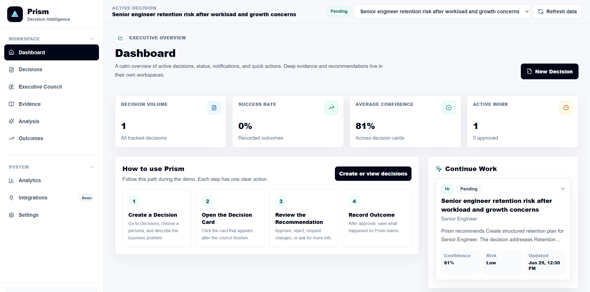
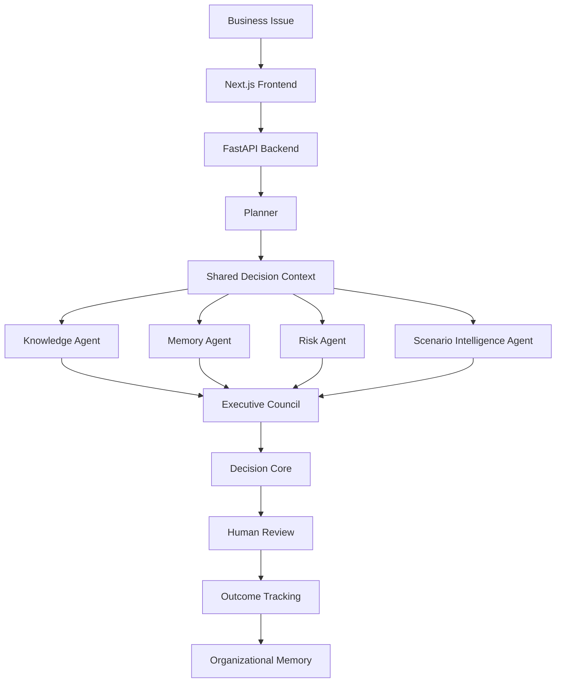

# Prism

### Enterprise Decision Intelligence Platform

> Prism transforms complex business problems into traceable, explainable, and human-reviewed enterprise decisions.


## Team

**Team Name:** DotTrio

| Team Member | Roll Number |
| --- | --- |
| Immadi Harshita | 23071A0583 |
| K Greeshma Reddy | 23071A0585 |
| Mohd Sania Tabassum | 23071A05A1 |

**GitHub Repository:** [Harshita-i/prism.git](https://github.com/Harshita-i/prism.git)

## Overview

Prism is built for enterprise teams that need to make important decisions with clarity, evidence, and accountability.

Most AI applications are designed around conversations. A user asks a question, the AI generates a response, and the reasoning often disappears inside a chat history. That works for simple assistance, but it is not enough for business-critical decisions such as saving a customer renewal, handling employee attrition risk, resolving a stalled enterprise deal, or responding to operational disruption.

Prism treats every important business problem as a **Decision**. A Decision is a persistent object that contains business context, supporting evidence, agent reasoning, risk analysis, scenario comparison, human review, lifecycle history, and final outcome. This makes Prism closer to an enterprise decision system than a normal chatbot.

## Enterprise Decision Challenge

Enterprise decisions are rarely made from one piece of information. They usually require policies, past experience, risk evaluation, alternatives, approvals, and follow-up learning.

Traditional AI tools can generate useful responses, but they usually do not provide:

- A structured decision lifecycle
- Evidence references
- Human approval workflow
- Historical outcome memory
- Clear accountability
- Reusable organizational learning

Because of this, teams may get an answer but still lack the governance needed to trust, review, and reuse that decision later.

## Why Prism?

| Traditional AI | Prism |
| --- | --- |
| Generates answers | Builds enterprise decisions |
| Stateless chat | Persistent decision records |
| Single LLM response | Multi-agent collaboration |
| Limited governance | Human approval workflow |
| No organizational memory | Learns from previous decisions |
| Limited explainability | Evidence-backed recommendations |
| Conversation-first | Decision-lifecycle-first |

Prism is designed to answer not only **"What should we do?"**, but also **"Why should we do it, what evidence supports it, who approved it, and what happened afterward?"**

## What Prism Does

Prism converts a business issue into a managed Decision.

For example, a user can enter:

```text
Atlas Bank enterprise deal is stalled because the customer has security and compliance objections.
```

Prism then:

1. Extracts the business context.
2. Retrieves relevant knowledge and policies.
3. Finds similar historical decisions.
4. Evaluates risk.
5. Compares possible strategies.
6. Runs an Executive Council discussion.
7. Generates a Decision Card.
8. Sends the recommendation for human review.
9. Records the final outcome.
10. Stores the result as organizational memory.

This creates a complete decision trail from problem to recommendation to outcome.

## Key Capabilities

### Multi-Persona Decision Support

Prism supports multiple business personas using the same underlying decision engine. Sales, HR, Healthcare, Operations, and Customer Success teams can all use Prism without changing the platform architecture. Only the business context, evidence, labels, and scenario options change.

### Planner-Led Orchestration

The Planner coordinates the decision workflow. It does not directly decide the final recommendation. Instead, it facilitates the process by preparing the shared decision context, coordinating agents, and sending the final council consensus to the Decision Core.

### Shared Decision Context

Every decision has a shared context object. This context stores the structured business problem, persona, evidence, memory, risk, scenario analysis, council discussion, recommendation, review status, and outcome.

This prevents agents from working in isolation and creates one source of truth for the decision.

### Executive Council

The Executive Council is where specialist agents contribute their findings. Knowledge brings policy evidence, Memory brings historical outcomes, Risk highlights exposure, and Scenario Intelligence compares possible future strategies.

The council makes Prism's reasoning visible instead of hiding it inside one AI response.

### Human-in-the-Loop Review

Prism does not automatically execute recommendations. A human can approve, reject, request changes, or ask for more information. This keeps accountability with the business user while still allowing AI to assist with reasoning.

### Outcome-Based Learning

After a decision is executed, Prism records the outcome. Successful, failed, and partially successful decisions become reusable organizational memory for future recommendations.

## Screenshots

Add final screenshots inside:

```text
docs/assets/
```

Suggested screenshots:

```text
docs/assets/dashboard.png
docs/assets/decisions.png
docs/assets/executive-council.png
docs/assets/evidence.png
docs/assets/analysis.png
docs/assets/recommendation.png
docs/assets/outcomes.png
```

Suggested Markdown placeholders:

```md



```

## Demo Links

Add final video links here before submission.

| Resource | Link |
| --- | --- |
| Product Demo Video | `<add product demo video link>` |
| Architecture Walkthrough Video | `<add architecture walkthrough video link>` |
| Architecture Documentation | [`docs/architecture.md`](docs/architecture.md) |
| Setup Guide | [`docs/setup-guide.md`](docs/setup-guide.md) |
| Demo Guide | [`docs/demo-guide.md`](docs/demo-guide.md) |

## High-Level Architecture



Detailed architecture and key design decisions are documented in [`docs/architecture.md`](docs/architecture.md).

## Core Components

### Frontend

The frontend is a workspace-style interface built with Next.js, React, TypeScript, and Tailwind CSS. It provides separate areas for dashboard overview, decisions, Executive Council, evidence, analysis, outcomes, and analytics.

### Backend

The backend is built with FastAPI. It exposes APIs for creating decisions, running the council, retrieving decision details, submitting human review actions, recording outcomes, and fetching analytics.

### Planner

The Planner is the orchestration layer. It coordinates the decision workflow and ensures that the right agents contribute to the decision process.

### Knowledge Agent

The Knowledge Agent retrieves relevant business policies, playbooks, and guidance. It converts enterprise knowledge into evidence packets that can be referenced by the final recommendation.

### Memory Agent

The Memory Agent retrieves similar historical decisions and outcomes. It helps Prism understand what worked or failed in previous cases.

### Risk Agent

The Risk Agent evaluates business, operational, financial, and confidence risks. It helps the platform avoid recommendations that appear unsupported or unsafe.

### Scenario Intelligence Agent

The Scenario Intelligence Agent compares multiple possible actions. It estimates likely success, risk, cost, complexity, confidence, and time to impact.

### Executive Council

The Executive Council combines the findings from specialist agents. It creates a visible reasoning trail before the final recommendation is generated.

### Decision Core

The Decision Core builds the final Decision Card from structured evidence, memory, risk, scenario analysis, and council consensus. It does not directly depend on a raw prompt as the final decision source.

### Human Review

Human Review allows the business user to approve, reject, request changes, or request more information before a recommendation is accepted.

## Decision Lifecycle

```text
Draft
  -> Evidence Collection
  -> Executive Council
  -> Scenario Analysis
  -> Recommendation
  -> Human Review
  -> Approved / Rejected / Changes Requested
  -> Outcome Recorded
  -> Memory Updated
```

Each stage gives the decision a clear audit trail.

## Technology Stack

### Frontend

- Next.js
- React
- TypeScript
- Tailwind CSS
- Lucide React

### Backend

- Python
- FastAPI
- Pydantic
- Uvicorn

### Intelligence Layer

- Planner orchestration
- Multi-agent reasoning
- Optional Gemini-compatible LLM layer
- Local fallback reasoning
- Knowledge and memory packet generation

### Knowledge and Memory

- Seeded enterprise knowledge base
- Historical decision memory
- Local semantic retrieval architecture
- ChromaDB and sentence-transformers support

## Quick Start

### 1. Clone Repository

```powershell
git clone https://github.com/Harshita-i/prism.git
cd prism
```

### 2. Backend Setup

```powershell
python -m venv .venv
.\.venv\Scripts\activate
pip install -r requirements.txt
```

### 3. Backend Environment

Create `.env` in the project root:

```env
PRISM_LLM_ENABLED=false
PRISM_LLM_PROVIDER=gemini
PRISM_LLM_MODEL=gemini-1.5-flash
GEMINI_API_KEY=
PRISM_LOG_LEVEL=INFO
PRISM_KNOWLEDGE_EMBEDDINGS=auto
```

### 4. Run Backend

```powershell
uvicorn app.main:app --reload --port 8000
```

Backend API:

```text
http://127.0.0.1:8000
```

API documentation:

```text
http://127.0.0.1:8000/docs
```

### 5. Frontend Setup

Open a second terminal:

```powershell
cd frontend
npm install --legacy-peer-deps
```

Create `frontend/.env.local`:

```env
NEXT_PUBLIC_API_URL=http://127.0.0.1:8000
```

### 6. Run Frontend

```powershell
npm run dev
```

Application:

```text
http://localhost:3000/dashboard
```

## Environment Variables

| Variable | Required | Description |
| --- | --- | --- |
| `NEXT_PUBLIC_API_URL` | Yes | Frontend URL for the FastAPI backend. |
| `PRISM_LLM_ENABLED` | No | Enables or disables LLM-assisted reasoning. |
| `PRISM_LLM_PROVIDER` | No | LLM provider. Current supported value: `gemini`. |
| `PRISM_LLM_MODEL` | If LLM enabled | Model used for LLM calls. |
| `GEMINI_API_KEY` | If LLM enabled | Gemini API key. |
| `PRISM_LLM_API_KEY` | If LLM enabled | Alternative generic LLM API key variable. |
| `PRISM_LLM_TEMPERATURE` | No | LLM temperature. Default: `0.2`. |
| `PRISM_LLM_MAX_TOKENS` | No | Maximum LLM output tokens. |
| `PRISM_LLM_TIMEOUT_SECONDS` | No | LLM request timeout. |
| `PRISM_LLM_CACHE_DISABLED` | No | Disables local LLM response cache when set to `true`. |
| `PRISM_LOG_LEVEL` | No | Backend logging level. |
| `PRISM_KNOWLEDGE_EMBEDDINGS` | No | Knowledge embedding mode. |

## Folder Structure

```text
prism/
  app/
    agents/
    core/
    knowledge/
    llm/
    memory/
    scenario/
    main.py
    models.py
    orchestrator.py
    personas.py
    storage.py
  frontend/
    app/
    components/
    lib/
    types/
    package.json
  scripts/
  docs/
    architecture.md
    setup-guide.md
    demo-guide.md
  requirements.txt
  README.md
```

## Demo Personas

| Persona | Use Case |
| --- | --- |
| Sales Manager | Move strategic opportunities forward with the right next action. |
| HR Manager | Reduce attrition risk with explainable retention support. |
| Healthcare Administrator | Improve patient flow and operational capacity. |
| Operations Manager | Protect delivery commitments when suppliers or inventory create risk. |
| Customer Success Manager | Save at-risk enterprise customers before renewal. |

## Sample Business Scenarios

### Sales

An enterprise banking deal is stalled because the customer has security and compliance concerns. Prism recommends a security-led technical validation workshop before commercial negotiation.

### HR

A senior engineer has declining engagement due to workload and career-growth concerns. Prism recommends a structured retention plan that addresses workload, growth path, and manager support.

### Customer Success

A SaaS renewal is at risk after pricing objections and competitor evaluation. Prism recommends an executive value workshop to prove business value before changing commercial terms.

### Operations

A supplier delay threatens a customer delivery commitment. Prism compares mitigation strategies and recommends the best next action based on urgency, risk, and business impact.

### Healthcare

A care unit is experiencing patient flow delays. Prism evaluates operational options and recommends a capacity improvement action without replacing clinical judgment.

## API Overview

| Method | Endpoint | Description |
| --- | --- | --- |
| `GET` | `/health` | Health check |
| `GET` | `/decisions` | List decisions |
| `POST` | `/decisions` | Create decision |
| `GET` | `/decisions/{decision_id}` | Get decision details |
| `POST` | `/decisions/{decision_id}/run` | Run decision council |
| `POST` | `/decisions/{decision_id}/review` | Submit human review |
| `POST` | `/decisions/{decision_id}/outcome` | Record outcome |
| `GET` | `/decisions/{decision_id}/versions` | Get version history |
| `GET` | `/decisions/{decision_id}/lifecycle` | Get lifecycle history |
| `GET` | `/analytics` | Get analytics |
| `GET` | `/decision-search` | Search decisions |

## Additional Notes

- Prism can run without an LLM API key using local fallback reasoning.
- Gemini-compatible LLM support can be enabled through environment variables.
- Current knowledge and memory are seeded for local execution.
- Real enterprise connectors such as SharePoint, Slack, Notion, Google Drive, and CRM can be added as future data sources.
- Prism supports decision intelligence and human review, not automatic business execution.

## Future Scope

- Enterprise authentication
- Role-based access control
- Enterprise document connectors
- Uploaded document ingestion
- Approval routing
- Audit exports
- Additional specialist agents
- Cloud deployment
- Advanced analytics

## Conclusion

Prism is more than an AI assistant.

It is a Decision Intelligence Platform that enables enterprises to make transparent, explainable, and accountable decisions through collaborative AI reasoning, human governance, and continuous organizational learning.

Instead of producing conversations, Prism builds institutional knowledge.
