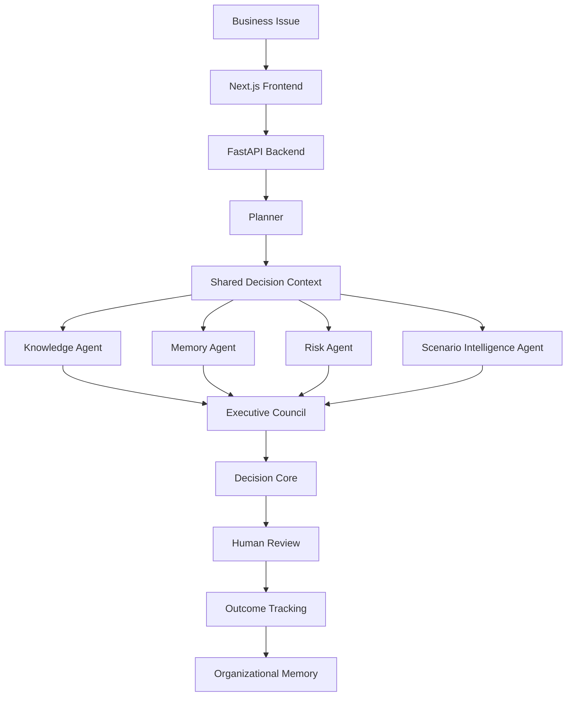

# Prism

### Enterprise Decision Intelligence Platform

> Transforming business problems into traceable, explainable, and human-reviewed enterprise decisions.


## Team

**Team Name:** DotTrio

| Team Member | Roll Number |
| --- | --- |
| Immadi Harshita | 23071A0583 |
| K Greeshma Reddy | 23071A0585 |
| Mohd Sania Tabassum | 23071A05A1 |

**GitHub Repository:** [Harshita-i/prism.git](https://github.com/Harshita-i/prism.git)

## Overview

Prism is a decision intelligence platform for teams that need to make important business decisions with evidence, accountability, and learning.

Most AI tools generate answers. Prism builds enterprise decisions.

Instead of leaving business reasoning inside a temporary chat window, Prism creates a persistent Decision Card with structured context, supporting evidence, agent reasoning, council consensus, human review, lifecycle history, and outcome tracking.

## Why Prism?

| Traditional AI | Prism |
| --- | --- |
| Generates answers | Builds enterprise decisions |
| Stateless chat | Persistent decision records |
| Single LLM response | Multi-agent collaboration |
| Limited governance | Human approval workflow |
| No organizational memory | Learns from previous decisions |
| Limited explainability | Evidence-backed recommendations |
| Conversation-first | Decision-lifecycle-first |

## Core Idea

Prism converts a business issue into a managed Decision.

Each Decision includes:

- Structured business context
- Knowledge evidence
- Historical memory
- Risk assessment
- Scenario analysis
- Executive Council discussion
- Final recommendation
- Human review status
- Lifecycle history
- Outcome record

## Highlights

- Multi-agent decision intelligence
- Planner-led orchestration
- Shared Decision Context
- Executive Council collaboration
- Evidence-backed recommendations
- Scenario Intelligence Agent
- Human-in-the-loop governance
- Organizational memory
- Outcome-based learning
- Reusable across multiple business domains

## Key Features

- Workspace-based enterprise dashboard
- Multi-persona decision creation
- Knowledge retrieval and evidence packets
- Memory retrieval from historical decisions
- Risk analysis
- Scenario comparison
- Executive Council discussion
- Recommendation generation
- Human approval workflow
- Outcome recording
- Decision lifecycle tracking
- Decision analytics

## Demo Links

Add final video links here before submission.

| Resource | Link |
| --- | --- |
| Architecture Documentation | [`docs/architecture.md`](docs/architecture.md) |
| Setup Guide | [`docs/setup-guide.md`](docs/setup-guide.md) |
| Demo Guide | [`docs/demo-guide.md`](docs/demo-guide.md) |


## High-Level Architecture



Detailed architecture and design decisions are documented in [`docs/architecture.md`](docs/architecture.md).

## Technology Stack

### Frontend

- Next.js
- React
- TypeScript
- Tailwind CSS
- Lucide React

### Backend

- Python
- FastAPI
- Pydantic
- Uvicorn

### Intelligence Layer

- Planner orchestration
- Multi-agent reasoning
- Optional Gemini-compatible LLM layer
- Local fallback reasoning
- Knowledge and memory packet generation

### Knowledge and Memory

- Seeded enterprise knowledge base
- Historical decision memory
- Local semantic retrieval architecture
- ChromaDB and sentence-transformers support

## Quick Start

### 1. Clone Repository

```powershell
git clone https://github.com/Harshita-i/prism.git
cd prism
```

### 2. Backend Setup

```powershell
python -m venv .venv
.\.venv\Scripts\activate
pip install -r requirements.txt
```

### 3. Backend Environment

Create `.env` in the project root:

```env
PRISM_LLM_ENABLED=false
PRISM_LLM_PROVIDER=gemini
PRISM_LLM_MODEL=gemini-1.5-flash
GEMINI_API_KEY=
PRISM_LOG_LEVEL=INFO
PRISM_KNOWLEDGE_EMBEDDINGS=auto
```

### 4. Run Backend

```powershell
uvicorn app.main:app --reload --port 8000
```

Backend API:

```text
http://127.0.0.1:8000
```

API documentation:

```text
http://127.0.0.1:8000/docs
```

### 5. Frontend Setup

Open a second terminal:

```powershell
cd frontend
npm install --legacy-peer-deps
```

Create `frontend/.env.local`:

```env
NEXT_PUBLIC_API_URL=http://127.0.0.1:8000
```

### 6. Run Frontend

```powershell
npm run dev
```

Application:

```text
http://localhost:3000/dashboard
```

## Environment Variables

| Variable | Required | Description |
| --- | --- | --- |
| `NEXT_PUBLIC_API_URL` | Yes | Frontend URL for the FastAPI backend. |
| `PRISM_LLM_ENABLED` | No | Enables or disables LLM-assisted reasoning. |
| `PRISM_LLM_PROVIDER` | No | LLM provider. Current supported value: `gemini`. |
| `PRISM_LLM_MODEL` | If LLM enabled | Model used for LLM calls. |
| `GEMINI_API_KEY` | If LLM enabled | Gemini API key. |
| `PRISM_LLM_API_KEY` | If LLM enabled | Alternative generic LLM API key variable. |
| `PRISM_LLM_TEMPERATURE` | No | LLM temperature. Default: `0.2`. |
| `PRISM_LLM_MAX_TOKENS` | No | Maximum LLM output tokens. |
| `PRISM_LLM_TIMEOUT_SECONDS` | No | LLM request timeout. |
| `PRISM_LLM_CACHE_DISABLED` | No | Disables local LLM response cache when set to `true`. |
| `PRISM_LOG_LEVEL` | No | Backend logging level. |
| `PRISM_KNOWLEDGE_EMBEDDINGS` | No | Knowledge embedding mode. |

## Folder Structure

```text
prism/
  app/
    agents/
    core/
    knowledge/
    llm/
    memory/
    scenario/
    main.py
    models.py
    orchestrator.py
    personas.py
    storage.py
  frontend/
    app/
    components/
    lib/
    types/
    package.json
  scripts/
  docs/
    architecture.md
    setup-guide.md
    demo-guide.md
  requirements.txt
  README.md
```

## Demo Personas

| Persona | Use Case |
| --- | --- |
| Sales Manager | Move strategic opportunities forward with the right next action. |
| HR Manager | Reduce attrition risk with explainable retention support. |
| Healthcare Administrator | Improve patient flow and operational capacity. |
| Operations Manager | Protect delivery commitments when suppliers or inventory create risk. |
| Customer Success Manager | Save at-risk enterprise customers before renewal. |

## Sample Business Scenarios

### Sales

An enterprise banking deal is stalled because the customer has security and compliance concerns. Prism recommends a security-led technical validation workshop.

### HR

A senior engineer has declining engagement due to workload and career-growth concerns. Prism recommends a structured retention plan.

### Customer Success

A SaaS renewal is at risk after pricing objections and competitor evaluation. Prism recommends an executive value workshop.

### Operations

A supplier delay threatens a customer delivery commitment. Prism compares mitigation strategies and recommends the best next action.

### Healthcare

A care unit is experiencing patient flow delays. Prism evaluates operational options and recommends a capacity improvement action.

## API Overview

| Method | Endpoint | Description |
| --- | --- | --- |
| `GET` | `/health` | Health check |
| `GET` | `/decisions` | List decisions |
| `POST` | `/decisions` | Create decision |
| `GET` | `/decisions/{decision_id}` | Get decision details |
| `POST` | `/decisions/{decision_id}/run` | Run decision council |
| `POST` | `/decisions/{decision_id}/review` | Submit human review |
| `POST` | `/decisions/{decision_id}/outcome` | Record outcome |
| `GET` | `/decisions/{decision_id}/versions` | Get version history |
| `GET` | `/decisions/{decision_id}/lifecycle` | Get lifecycle history |
| `GET` | `/analytics` | Get analytics |
| `GET` | `/decision-search` | Search decisions |

## Future Scope

- Enterprise authentication
- Role-based access control
- Enterprise document connectors
- Uploaded document ingestion
- Approval routing
- Audit exports
- Additional specialist agents
- Cloud deployment
- Advanced analytics

## Conclusion

Prism is more than an AI assistant.

It is a Decision Intelligence Platform that enables enterprises to make transparent, explainable, and accountable decisions through collaborative AI reasoning, human governance, and continuous organizational learning.

Instead of producing conversations, Prism builds institutional knowledge.
