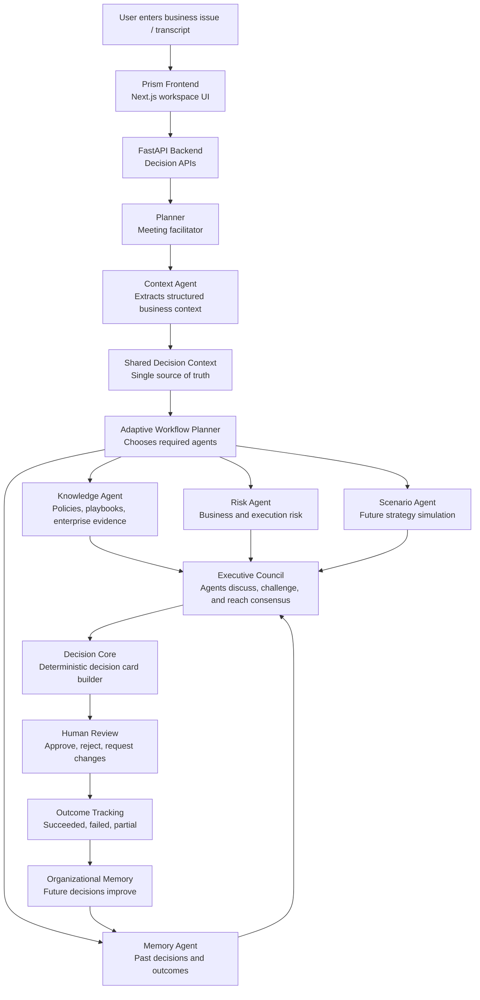

```mermaid
flowchart TD
    A["User enters business issue / transcript"] --> B["Prism Frontend<br/>Next.js workspace UI"]

    B --> C["FastAPI Backend<br/>Decision APIs"]

    C --> D["Planner<br/>Meeting facilitator"]

    D --> E["Context Agent<br/>Extracts structured business context"]

    E --> F["Shared Decision Context<br/>Single source of truth"]

    F --> G["Adaptive Workflow Planner<br/>Chooses required agents"]

    G --> H["Knowledge Agent<br/>Policies, playbooks, enterprise evidence"]
    G --> I["Memory Agent<br/>Past decisions and outcomes"]
    G --> J["Risk Agent<br/>Business and execution risk"]
    G --> K["Scenario Agent<br/>Future strategy simulation"]

    H --> L["Executive Council<br/>Agents discuss, challenge, and reach consensus"]
    I --> L
    J --> L
    K --> L

    L --> M["Decision Core<br/>Deterministic decision card builder"]

    M --> N["Human Review<br/>Approve, reject, request changes"]

    N --> O["Outcome Tracking<br/>Succeeded, failed, partial"]

    O --> P["Organizational Memory<br/>Future decisions improve"]
    P --> I
```
