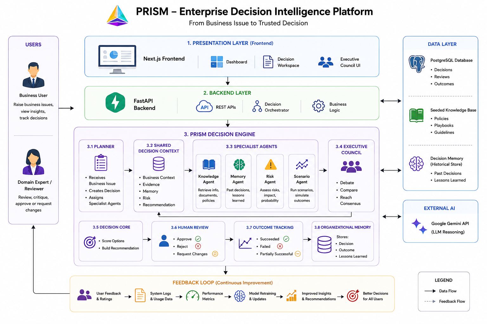
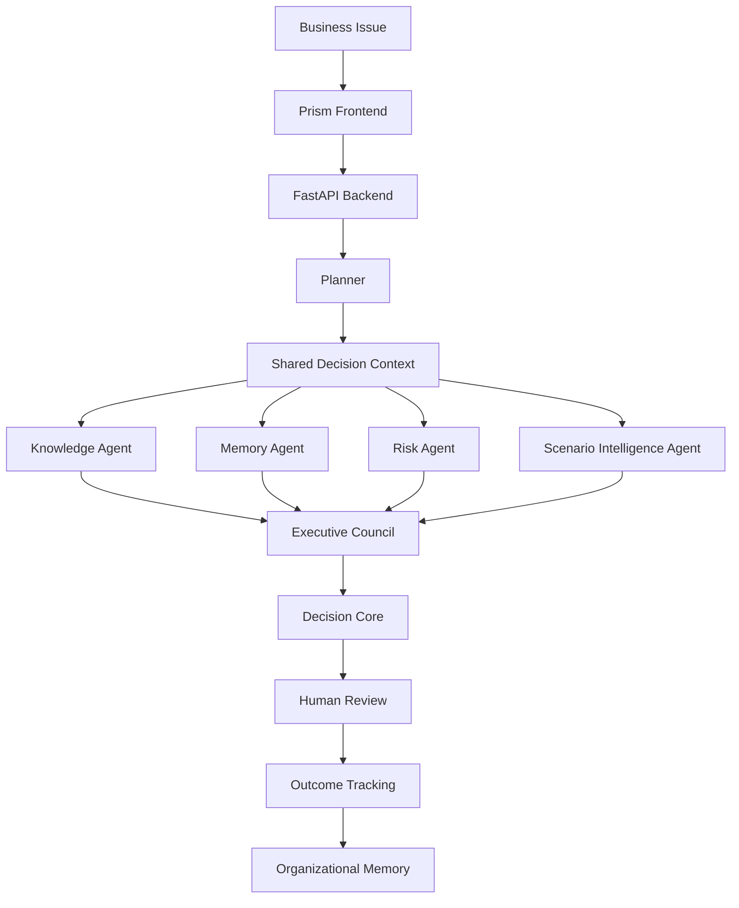

# Prism

### Enterprise Decision Intelligence Platform

> Transforming business problems into traceable, explainable, and human-reviewed enterprise decisions.


Prism is a decision intelligence platform for teams that need to make important business decisions with evidence, accountability, and learning.

- Multi-agent decision intelligence
- Organizational memory
- Explainable recommendations
- Human-in-the-loop governance
- Outcome-based learning

## Demo

Add final submission links here:

| Resource | Link |
| --- | --- |
| Product Demo | `<add product demo video link>` |
| Architecture Walkthrough | `<add architecture walkthrough video link>` |
| Documentation | [`docs/architecture.md`](docs/architecture.md) |
| Setup Guide | [`docs/setup-guide.md`](docs/setup-guide.md) |

## Overview

Most AI tools generate answers. Prism builds enterprise decisions.

Instead of leaving business reasoning inside a temporary chat window, Prism creates a persistent Decision Card with structured context, evidence, agent reasoning, council consensus, human review, lifecycle history, and outcome tracking.

The same decision engine can support Sales, HR, Healthcare, Operations, Customer Success, and other enterprise workflows.

## Enterprise Decision Challenge

Important decisions require more than a generated answer.

Enterprise teams need:

- Clear business context
- Supporting evidence
- Risk analysis
- Alternatives
- Human approval
- Outcome tracking
- Reusable organizational learning

Without these, decisions become difficult to audit, explain, govern, or improve.

## Why Prism?

| Traditional AI | Prism |
| --- | --- |
| Generates answers | Builds enterprise decisions |
| Stateless chat | Persistent decision records |
| Single LLM response | Multi-agent collaboration |
| Limited governance | Human approval workflow |
| No organizational memory | Learns from previous decisions |
| Limited explainability | Evidence-backed recommendations |
| Conversation-first | Decision-lifecycle-first |

## How Prism Works

Prism converts a business issue into a managed Decision.

Each Decision includes:

- Structured business context
- Knowledge evidence
- Historical memory
- Risk assessment
- Scenario analysis
- Executive Council discussion
- Final recommendation
- Human review status
- Lifecycle history
- Outcome record

This makes every decision traceable from the original business problem to the final result.

## Highlights

- Multi-agent AI architecture
- Planner-led orchestration
- Shared Decision Context
- Executive Council collaboration
- Evidence-backed reasoning
- Scenario Intelligence Agent
- Human-in-the-loop decision making
- Organizational memory
- Reusable across multiple business domains
- Enterprise-ready decision lifecycle

## Key Features

- Workspace-based enterprise dashboard
- Multi-persona decision creation
- Knowledge retrieval and evidence packets
- Memory retrieval from historical decisions
- Risk analysis
- Scenario comparison
- Executive Council discussion
- Recommendation generation
- Human approval workflow
- Outcome recording
- Decision lifecycle tracking
- Decision analytics

## Quick Start

```powershell
git clone https://github.com/Harshita-i/prism.git
cd prism

python -m venv .venv
.\.venv\Scripts\activate
pip install -r requirements.txt

uvicorn app.main:app --reload --port 8000
```

Open a second terminal:

```powershell
cd frontend
npm install --legacy-peer-deps
npm run dev
```

Open the application:

```text
http://localhost:3000/dashboard
```

## System Architecture
<p align="center">
  
</p>

## Architecture flow



## Core Components

### Planner

Coordinates the decision workflow. The Planner facilitates the process but does not directly make the final decision.

### Shared Decision Context

Stores the current state of the decision. Agents read from and write to this shared context so the system has one source of truth.

### Knowledge Agent

Retrieves relevant policies, playbooks, and business guidance. It converts knowledge into structured evidence packets.

### Memory Agent

Finds similar historical decisions and outcomes. It helps Prism learn from previous business experience.

### Risk Agent

Identifies business, operational, financial, and confidence risks.

### Scenario Intelligence Agent

Compares possible strategies and estimates expected impact, risk, cost, confidence, and time to impact.

### Executive Council

Combines specialist findings into a collaborative discussion. The council challenges assumptions, references evidence, and reaches consensus.

### Decision Core

Builds the final Decision Card from structured context, evidence, memory, risk, scenarios, and council consensus.

### Human Review

Allows a human to approve, reject, request changes, or ask for more information before a decision is executed.

## Decision Lifecycle

```text
Draft
  -> Evidence Collection
  -> Executive Council
  -> Scenario Analysis
  -> Recommendation
  -> Human Review
  -> Approved / Rejected / Changes Requested
  -> Outcome Recorded
  -> Memory Updated
```

## Technology Stack

### Frontend

- Next.js
- React
- TypeScript
- Tailwind CSS
- Lucide React

### Backend

- Python
- FastAPI
- Pydantic
- Uvicorn

### Intelligence Layer

- Planner orchestration
- Multi-agent reasoning
- Optional Gemini-compatible LLM layer
- Local fallback reasoning
- Knowledge and memory packet generation

### Knowledge and Memory

- Seeded enterprise knowledge base
- Historical decision memory
- Local semantic retrieval architecture
- ChromaDB and sentence-transformers support

## Installation

For a beginner-friendly setup walkthrough, see [`docs/setup-guide.md`](docs/setup-guide.md).

### Prerequisites

- Python 3.11 or newer
- Node.js 20 or newer
- npm
- Git

### Clone Repository

```powershell
git clone https://github.com/Harshita-i/prism.git
cd prism
```

### Backend Setup

```powershell
python -m venv .venv
.\.venv\Scripts\activate
pip install -r requirements.txt
```

### Frontend Setup

```powershell
cd frontend
npm install --legacy-peer-deps
```

### Backend Environment

Create `.env` in the project root:

```env
PRISM_LLM_ENABLED=false
PRISM_LLM_PROVIDER=gemini
PRISM_LLM_MODEL=gemini-2.5-flash
GEMINI_API_KEY=
PRISM_LOG_LEVEL=INFO
PRISM_KNOWLEDGE_EMBEDDINGS=auto
```

### Frontend Environment

Create `frontend/.env.local`:

```env
NEXT_PUBLIC_API_URL=http://127.0.0.1:8000
```

### Run Backend

From the project root:

```powershell
uvicorn app.main:app --reload --port 8000
```

Backend API:

```text
http://127.0.0.1:8000
```

API documentation:

```text
http://127.0.0.1:8000/docs
```

### Run Frontend

Open a second terminal:

```powershell
cd frontend
npm run dev
```

Application:

```text
http://localhost:3000/dashboard
```

## Environment Variables

| Variable | Required | Description |
| --- | --- | --- |
| `NEXT_PUBLIC_API_URL` | Yes | Frontend URL for the FastAPI backend. |
| `PRISM_LLM_ENABLED` | No | Enables or disables LLM-assisted reasoning. |
| `PRISM_LLM_PROVIDER` | No | LLM provider. Current supported value: `gemini`. |
| `PRISM_LLM_MODEL` | If LLM enabled | Model used for LLM calls. |
| `GEMINI_API_KEY` | If LLM enabled | Gemini API key. |
| `PRISM_LLM_API_KEY` | If LLM enabled | Alternative generic LLM API key variable. |
| `PRISM_LLM_TEMPERATURE` | No | LLM temperature. Default: `0.2`. |
| `PRISM_LLM_MAX_TOKENS` | No | Maximum LLM output tokens. |
| `PRISM_LLM_TIMEOUT_SECONDS` | No | LLM request timeout. |
| `PRISM_LLM_CACHE_DISABLED` | No | Disables local LLM response cache when set to `true`. |
| `PRISM_LOG_LEVEL` | No | Backend logging level. |
| `PRISM_KNOWLEDGE_EMBEDDINGS` | No | Knowledge embedding mode. |

## Folder Structure

```text
prism/
  app/
    agents/
    core/
    knowledge/
    llm/
    memory/
    scenario/
    main.py
    models.py
    orchestrator.py
    personas.py
    storage.py
  frontend/
    app/
    components/
    lib/
    types/
    package.json
  scripts/
  docs/
    architecture.md
    setup-guide.md
    demo-guide.md
  requirements.txt
  README.md
```

## Demo Personas

Prism supports multiple enterprise personas using the same decision architecture.

| Persona | Use Case |
| --- | --- |
| Sales Manager | Move strategic opportunities forward with the right next action. |
| HR Manager | Reduce attrition risk with explainable retention support. |
| Healthcare Administrator | Improve patient flow and operational capacity. |
| Operations Manager | Protect delivery commitments when suppliers or inventory create risk. |
| Customer Success Manager | Save at-risk enterprise customers before renewal. |

## Sample Business Scenarios

### Sales

An enterprise banking deal is stalled because the customer has security and compliance concerns. Prism recommends a security-led technical validation workshop.

### HR

A senior engineer has declining engagement due to workload and career-growth concerns. Prism recommends a structured retention plan.

### Customer Success

A SaaS renewal is at risk after pricing objections and competitor evaluation. Prism recommends an executive value workshop.

### Operations

A supplier delay threatens a customer delivery commitment. Prism compares mitigation strategies and recommends the best next action.

### Healthcare

A care unit is experiencing patient flow delays. Prism evaluates operational options and recommends a capacity improvement action.

## API Overview

| Method | Endpoint | Description |
| --- | --- | --- |
| `GET` | `/health` | Health check |
| `GET` | `/decisions` | List decisions |
| `POST` | `/decisions` | Create decision |
| `GET` | `/decisions/{decision_id}` | Get decision details |
| `POST` | `/decisions/{decision_id}/run` | Run decision council |
| `POST` | `/decisions/{decision_id}/review` | Submit human review |
| `POST` | `/decisions/{decision_id}/outcome` | Record outcome |
| `GET` | `/decisions/{decision_id}/versions` | Get version history |
| `GET` | `/decisions/{decision_id}/lifecycle` | Get lifecycle history |
| `GET` | `/analytics` | Get analytics |
| `GET` | `/decision-search` | Search decisions |

## Known Limitations

- The current version uses seeded demo knowledge and memory.
- Real enterprise data connectors are not included yet.
- Authentication and role-based access are not included yet.
- LLM usage is optional and depends on API configuration.
- Prism supports decision intelligence and review, not automatic business execution.

## Future Scope

- Enterprise authentication
- Role-based access control
- SharePoint, Slack, Notion, Google Drive, and CRM connectors
- Uploaded document ingestion
- Advanced analytics
- Approval routing
- Audit exports
- Additional specialist agents
- Cloud deployment

## Conclusion

Prism is more than an AI assistant.

It is a Decision Intelligence Platform that enables enterprises to make transparent, explainable, and accountable decisions through collaborative AI reasoning, human governance, and continuous organizational learning.

Instead of producing conversations, Prism builds institutional knowledge.
