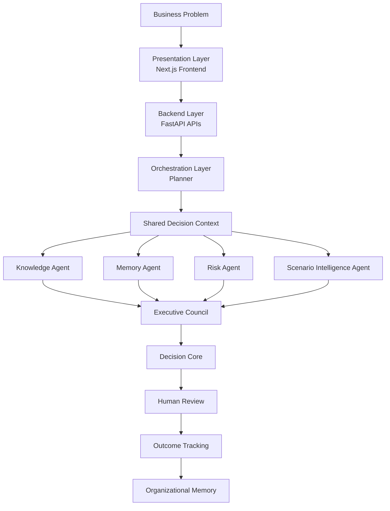
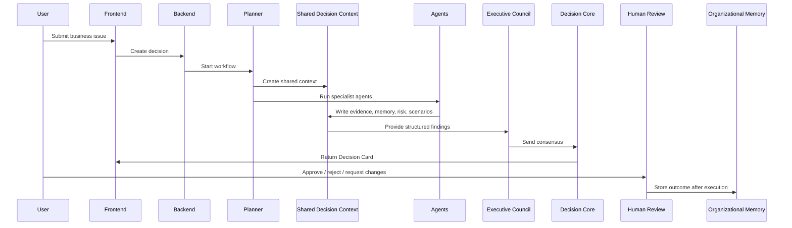

# Prism Architecture

Prism is designed around one principle:

> Enterprise AI should manage decisions, not conversations.

The architecture separates presentation, orchestration, specialist reasoning, governance, and learning so that every decision is traceable, explainable, and reusable.

## 1. High-Level Architecture



## 2. Architecture Layers

### Presentation Layer

The presentation layer is the user-facing workspace built with Next.js, React, TypeScript, and Tailwind CSS.

It allows users to:

- Create decisions
- Select business personas
- Review council discussion
- Inspect evidence
- Compare analysis
- Approve or reject recommendations
- Record outcomes

The frontend remains lightweight. It collects business input and displays structured decision outputs.

### Backend Layer

The backend layer is implemented with FastAPI.

It is responsible for:

- Exposing REST APIs
- Validating requests
- Creating decisions
- Running the decision pipeline
- Recording human reviews
- Recording outcomes
- Returning analytics, lifecycle history, and version history

### Orchestration Layer

The orchestration layer contains the Planner.

The Planner is not the final decision-maker. It acts as the facilitator of the decision workflow.

Its responsibilities include:

- Starting the decision pipeline
- Creating the Shared Decision Context
- Coordinating specialist agents
- Managing execution order
- Sending specialist outputs to the Executive Council
- Passing consensus to the Decision Core

### Shared Decision Context

The Shared Decision Context is the central communication object of Prism.

Instead of passing raw prompts between agents, Prism stores structured decision state in one shared context.

It contains:

- Business context
- Persona
- Knowledge evidence
- Historical memory
- Risk findings
- Scenario analysis
- Council messages
- Consensus
- Recommendation
- Human review state
- Outcome state

This keeps the system explainable and avoids isolated agent reasoning.

### Specialist Intelligence Layer

The specialist layer contains focused agents. Each agent owns one responsibility.

| Agent | Responsibility |
| --- | --- |
| Knowledge Agent | Retrieves policies, playbooks, and evidence packets. |
| Memory Agent | Retrieves similar historical decisions and outcomes. |
| Risk Agent | Evaluates business, operational, financial, and confidence risk. |
| Scenario Intelligence Agent | Compares multiple possible strategies and expected outcomes. |

### Executive Council

The Executive Council is the collaborative reasoning layer.

Specialist outputs are not treated as isolated summaries. The council combines agent findings, challenges assumptions, compares evidence, and produces consensus.

This makes the reasoning process visible before the final recommendation is created.

### Decision Core

The Decision Core assembles the final Decision Card.

It receives structured context, evidence, memory, risk, scenario analysis, and council consensus.

It produces:

- Recommendation
- Alternatives
- Decision matrix
- Supporting evidence
- Confidence
- Risk explanation
- Time to impact
- Human review status

The Decision Core is deterministic. It does not directly trust a raw LLM response as the final decision.

### Human Review

Before any business action is considered approved, the recommendation enters Human Review.

Supported review actions:

- Approve
- Reject
- Request changes
- Request more information

This keeps humans accountable and prevents automatic execution.

### Organizational Memory

Once an outcome is recorded, the decision becomes part of Prism's organizational memory.

Future decisions can use previous outcomes as historical evidence.

## 3. Runtime Workflow



## 4. Decision Lifecycle

```text
Draft
  -> Evidence Collection
  -> Executive Council
  -> Scenario Analysis
  -> Recommendation
  -> Human Review
  -> Approved / Rejected / Changes Requested
  -> Outcome Recorded
  -> Memory Updated
```

Each stage is stored so the decision remains traceable and reviewable.

## 5. Key Design Decisions

### Decision-First Architecture

Prism stores decisions instead of conversations.

A decision contains evidence, reasoning, review status, lifecycle history, and outcome data. This makes business reasoning reusable.

### Planner Does Not Decide

The Planner orchestrates the workflow but does not directly generate the final recommendation.

This separation keeps orchestration independent from decision generation.

### Shared Context Instead of Agent-to-Agent Prompt Passing

Agents do not depend on private conversations with each other.

Every specialist reads from and writes to the Shared Decision Context. This improves traceability and makes the architecture easier to extend.

### Specialist Agents

Each agent has a focused responsibility.

This avoids asking one model or one component to solve the entire business problem.

### Evidence Packets

Knowledge and memory are converted into structured evidence packets.

The council discusses evidence, not raw documents.

### Executive Council Before Recommendation

The final recommendation is not produced immediately after retrieval.

Specialist findings first pass through a council discussion so assumptions can be challenged and alternatives can be compared.

### Deterministic Decision Core

The Decision Core assembles the final Decision Card using structured data.

This makes the final output more predictable, explainable, and auditable.

### Human-in-the-Loop Governance

Prism does not automatically execute recommendations.

Human review is required before the decision is accepted.

### Outcome-Based Learning

Prism records what happened after the decision.

Successful, failed, or partially successful outcomes become organizational memory for future cases.

### Reusable Persona Model

The same architecture works across business domains.

Only the persona context, domain labels, evidence, and scenarios change.

## 6. Technology Mapping

| Layer | Tools |
| --- | --- |
| Frontend | Next.js, React, TypeScript, Tailwind CSS |
| Backend APIs | FastAPI, Python, Pydantic, Uvicorn |
| LLM Layer | Gemini-compatible service, optional fallback reasoning |
| Knowledge Intelligence | Evidence packets, local knowledge base, ChromaDB/sentence-transformers support |
| Memory Intelligence | Historical decision memory, outcome records |
| Storage | Local decision persistence |
| Documentation | Markdown, Mermaid diagrams |

## 7. Extensibility

Prism is modular by design.

Future extensions can include:

- SharePoint knowledge connector
- Slack discussion connector
- CRM opportunity connector
- Notion or Google Drive document connector
- Legal Agent
- Finance Agent
- Compliance Agent
- Market Intelligence Agent
- Role-based approval workflow
- Enterprise authentication

These additions can feed the same Shared Decision Context without redesigning the decision engine.

## 8. Summary

Prism separates the decision process into clear layers:

- Presentation
- Backend APIs
- Planning
- Shared context
- Specialist intelligence
- Council reasoning
- Deterministic decision generation
- Human governance
- Organizational learning

This architecture makes Prism explainable, auditable, and reusable across multiple enterprise decision workflows.
