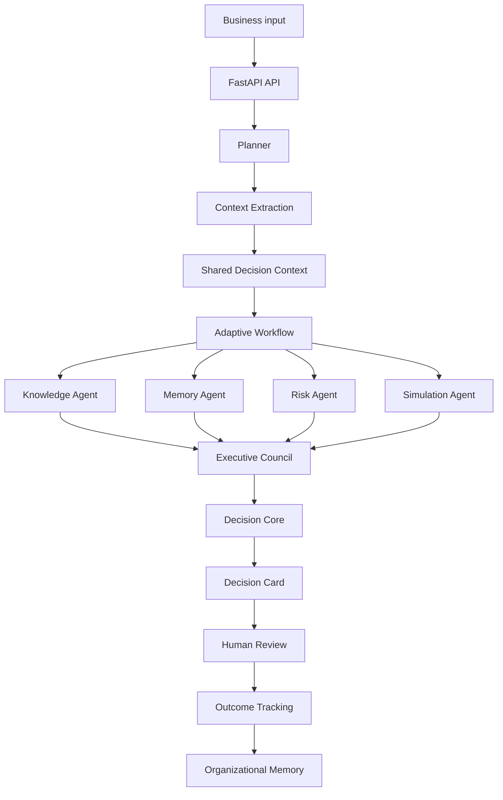

# Prism Technical Documentation

## Executive Summary

Prism is an Enterprise Decision Intelligence Platform for governed, evidence-backed business decisions.

The platform helps enterprise teams convert complex business situations into structured, explainable, human-reviewed decisions. Prism is designed around the idea that businesses do not need temporary AI chat responses; they need decisions that are traceable, evidence-backed, reviewable, outcome-aware, and reusable.

Prism uses a multi-agent architecture with a Planner, Shared Decision Context, specialist agents, an Executive Council, a deterministic Decision Core, Human Review, and Organizational Memory.

## Objectives

The main objectives of Prism are:

- Convert business issues into structured decisions.
- Support multiple enterprise personas.
- Use specialist agents for evidence, memory, risk, and scenario analysis.
- Make recommendations explainable and auditable.
- Keep humans in control before execution.
- Record outcomes and improve future decisions.
- Demonstrate a reusable platform architecture for enterprise decision intelligence.

## System Overview

Prism is composed of two major layers:

```text
Frontend workspace
  -> FastAPI backend
  -> Decision intelligence engine
  -> Decision storage and memory
```

The frontend gives users a workspace for creating decisions, reviewing council discussion, inspecting evidence, comparing scenarios, approving recommendations, and recording outcomes.

The backend owns the decision intelligence workflow. It receives business input, creates a Decision Context, runs specialist agents, generates an Executive Council discussion, assembles a Decision Card, and stores the result.

## Architecture flow



## Agent Responsibilities

### Planner

The Planner acts as an orchestration layer. It controls the decision workflow but does not directly decide the final recommendation.

Responsibilities:

- Create the decision execution flow.
- Coordinate agents.
- Monitor evidence availability.
- Track confidence and coverage.
- Trigger Executive Council discussion.
- Forward consensus to Decision Core.

### Context Agent

The Context Agent interprets the user's business input and converts it into structured business context.

Responsibilities:

- Extract primary problem.
- Detect urgency.
- Detect sentiment.
- Identify entities.
- Identify business signals.
- Normalize raw input into structured facts.

### Knowledge Agent

The Knowledge Agent retrieves enterprise knowledge and produces Knowledge Packets.

Responsibilities:

- Retrieve relevant policies and playbooks.
- Rank evidence by business relevance.
- Convert raw knowledge into structured findings.
- Provide policy constraints and supporting evidence.

### Memory Agent

The Memory Agent retrieves similar past decisions and outcomes.

Responsibilities:

- Search historical business decisions.
- Rank similar cases.
- Identify winning patterns.
- Identify failure patterns.
- Provide organizational learning evidence.

### Risk Agent

The Risk Agent evaluates risk.

Responsibilities:

- Identify business risk.
- Identify operational risk.
- Identify financial or confidence risk.
- Challenge unsafe recommendations.
- Highlight missing information.

### Simulation Agent

The Simulation Agent evaluates future strategies.

Responsibilities:

- Generate possible strategies.
- Estimate success probability.
- Estimate risk, cost, complexity, and time to impact.
- Rank scenario options.
- Explain why alternatives are weaker.

### Executive Council

The Executive Council is the collaborative reasoning layer.

Responsibilities:

- Let agents discuss findings.
- Challenge assumptions.
- Reference evidence.
- Compare strategies.
- Surface disagreements.
- Reach consensus.

### Decision Core

Decision Core converts the council consensus into a structured Decision Card.

Responsibilities:

- Assemble recommendation.
- Build alternative strategies.
- Produce decision matrix.
- Attach evidence references.
- Calculate confidence.
- Preserve traceability.

Decision Core is intentionally deterministic. The LLM does not directly approve or execute the decision.

## Decision Pipeline

The Prism decision pipeline is:

```text
User input
  -> Context extraction
  -> Shared Decision Context
  -> Adaptive agent selection
  -> Knowledge retrieval
  -> Memory retrieval
  -> Risk analysis
  -> Scenario simulation
  -> Executive Council
  -> Decision Core
  -> Human Review
  -> Outcome Tracking
  -> Memory Update
```

## Technology Choices

### Why FastAPI?

FastAPI was chosen because it is lightweight, fast, and well suited for Python-based decision services. It provides automatic Swagger documentation, strong Pydantic integration, and a simple development workflow for API-driven systems.

### Why React and Next.js?

React and Next.js were chosen because they make it easy to build a polished workspace-style frontend. The application needs multiple pages, dashboard views, decision details, and interactive review actions. Next.js provides clean routing and strong TypeScript support.

### Why Gemini?

Gemini-compatible LLM support was used for optional context extraction and council reasoning. Prism is designed so the LLM supports reasoning, but does not directly own the final enterprise decision.

The system can also run in fallback mode without an API key, which keeps the core workflow available when an external LLM provider is not configured.

### Why Planner?

The Planner prevents Prism from behaving like a simple fixed pipeline. It coordinates specialists and keeps the workflow organized. This reflects how enterprise decisions are usually handled: a facilitator gathers the right experts before a decision is made.

### Why Executive Council?

The Executive Council is the signature product idea. Instead of isolated agent summaries, Prism presents a council-style discussion where different specialists contribute evidence, challenge assumptions, and converge on a recommendation.

### Why Human Review?

Enterprise decisions should not be executed automatically by AI. Human Review ensures accountability, governance, and trust. Prism supports approval, rejection, requests for changes, and outcome recording.

## Design Decisions

### Shared Decision Context

All agents read from and write to a shared Decision Context. This prevents isolated reasoning and gives the platform a single source of truth.

### Evidence Packets

Knowledge and memory are converted into structured packets. The Executive Council discusses business evidence, not raw documents or unstructured text.

### Deterministic Decision Core

The final Decision Card is assembled by Python logic. This makes the recommendation more predictable, auditable, and easier to explain.

### Persona Configuration

The same engine supports multiple personas by changing business context, labels, KPIs, sample cases, and domain evidence.

## Security Considerations

The current implementation does not include full production security. For production use, Prism would need:

- Authentication
- Role-based access control
- Workspace isolation
- Audit logging
- Encryption at rest
- Secure secret management
- Enterprise connector permissions
- Approval routing
- Data retention policies

The current implementation focuses on decision intelligence architecture. Production deployment would require additional security hardening.

## Scalability

Prism can scale in several directions:

- More personas
- More specialist agents
- More evidence connectors
- More decision records
- Stronger search and analytics
- Cloud deployment
- Queue-based agent execution
- Background outcome tracking

The key scalability advantage is modularity. New agents and data sources can be added without rewriting the core decision lifecycle.

## Future Enhancements

- SharePoint, Slack, Notion, Google Drive, and CRM connectors
- Real document upload and indexing
- Authentication and user roles
- Team workspaces
- Approval workflows
- Exportable audit reports
- Advanced analytics
- Legal, Finance, Compliance, and Market Intelligence agents
- Cloud deployment
- More robust testing
- Real-time council streaming UI

## Conclusion

Prism shows how agentic AI can become enterprise decision infrastructure.

The platform does not merely generate answers. It creates governed decisions with evidence, council reasoning, human review, outcome tracking, and organizational memory.

Prism's core idea is:

```text
Do not remember chats.
Remember business decisions.
```

That is what makes Prism different from a normal AI assistant.
